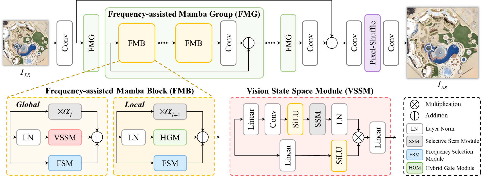

# FreMamba (IEEE TMM, 2024)
### 📖[**Paper**](https://ieeexplore.ieee.org/document/10387229) | 🖼️[**PDF**](/fig/TTST.pdf)

PyTorch codes for "[Frequency-Assisted Mamba for Remote Sensing Image Super-Resolution](https://ieeexplore.ieee.org/document/10387229)", **IEEE Transactions on Multimedia (TMM)**, 2024.

- Authors: [Yi Xiao](https://xy-boy.github.io/), [Qiangqiang Yuan*](http://qqyuan.users.sgg.whu.edu.cn/), [Kui Jiang](https://homepage.hit.edu.cn/jiangkui?lang=zh), [Yuzeng Chen](https://jianghe96.github.io/), [Qiang Zhang](https://qzhang95.github.io/), and [Chia-Wen Lin](https://www.ee.nthu.edu.tw/cwlin/)<br>

&nbsp;&nbsp;&nbsp;  &nbsp;&nbsp; &nbsp;&nbsp; &nbsp;&nbsp;

### 🌱 Abstract
>Recent progress in remote sensing image (RSI) super-resolution (SR) has exhibited remarkable performance using deep neural networks, e.g., Convolutional Neural Networks and Transformers. However, existing SR methods often suffer
from either a limited receptive field or quadratic computational overhead, resulting in sub-optimal global representation and unacceptable computational costs in large-scale RSI. To alleviate these issues, we develop the first attempt
to integrate the Vision State Space Model (Mamba) for RSI-SR, which specializes in processing large-scale RSI by capturing long-range dependency with linear complexity. To achieve better SR reconstruction, building upon Mamba, we devise a Frequency-assisted Mamba framework, dubbed FMSR, to explore the spatial and frequent correlations. In particular, our FMSR features a multi-level fusion architecture equipped with the Frequency Selection Module (FSM), Vision State Space Module (VSSM), and Hybrid Gate Module (HGM) to grasp their merits for effective spatial-frequency fusion. Recognizing that global and local dependencies are complementary and both beneficial for SR, we further recalibrate these multi-level features for accurate feature fusion via learnable scaling adaptors. Extensive experiments on AID, DOTA, and DIOR benchmarks demonstrate that our FMSR outperforms state-of-the-art Transformer-based methods HAT-L in terms of PSNR by 0.11 dB on average, while consuming only 28.05% and 19.08% of its memory consumption and complexity, respectively.
>

### Overall
<div align=center>

</div>

### Install
```
git clone https://github.com/XY-boy/FreMamba.git
```

## 🎁 Dataset
Please download the following remote sensing benchmarks:
| Data Type | [AID](https://captain-whu.github.io/AID/) | [DOTA-v1.0](https://captain-whu.github.io/DOTA/dataset.html) | [DIOR](https://www.sciencedirect.com/science/article/pii/S0924271619302825) | [NWPU-RESISC45](https://ieeexplore.ieee.org/abstract/document/7891544)
| :----: | :-----: | :----: | :----: | :----: |
|Training | [Download](https://captain-whu.github.io/AID/) | None | None | None |
|Testing | [Download](https://captain-whu.github.io/AID/) | [Download](https://captain-whu.github.io/DOTA/dataset.html) | [Download](https://drive.google.com/drive/folders/1UdlgHk49iu6WpcJ5467iT-UqNPpx__CC) | [Download](https://onedrive.live.com/?authkey=%21AHHNaHIlzp%5FIXjs&id=5C5E061130630A68%21107&cid=5C5E061130630A68&parId=root&parQt=sharedby&o=OneUp)

## 📃 Requirements
> * CUDA 11.1
> * Python 3.9.13
> * PyTorch 1.9.1
> * Torchvision 0.10.1
> * causal_conv1d==1.0.0
> * mamba_ssm==1.0.1

## 🧩 Usage
### Test
- **Step I.**  Use the structure below to prepare your dataset, e.g., DOTA, and DIOR.
/xxxx/xxx/ (your data path)
```
/GT/ 
   /000.png  
   /···.png  
   /099.png  
/LR/ 
   /000.png  
   /···.png  
   /099.png  
```
- **Step II.**  Change the `--data_dir` to your data path.
- **Step III.**  Change the `--pretrained_sr` to your pre-trained model path. 
- **Step IV.**  Run the eval_4x.py
```
python eval_4x.py
```

### Train
```
python train_4x.py
```

## Acknowledgement
Our work is built upon [MambaIR](https://github.com/csguoh/MambaIR). Thanks to the author for sharing this awesome work!

### 🥰 Citation
If you find our work helpful in your research, please consider citing it!
```
@ARTICLE{xiao2024fmsr,
  author={Xiao, Yi and Yuan, Qiangqiang and Jiang, Kui and Chen, Yuzeng and Zhang, Qiang and Lin, Chia-Wen},
  journal={IEEE Transactions on Multimedia}, 
  title={Frequency-Assisted Mamba for Remote Sensing Image Super-Resolution}, 
  year={2024},
  volume={},
  number={},
  pages={1-14},
}
```


